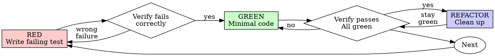

# Test-Driven Development

## Overview

In StellarDown, implementation follows this pipeline:

1. Domain document first
2. Failing tests second
3. Minimal implementation third
4. Green tests fourth
5. Update the same domain document when implementation changes actual behavior, limits, commands, or verification evidence

Then taskboard activity, the development diary, the domain document, and final checks provide the completion record.

**Core principle:** If you didn't watch the test fail, you don't know if it tests the right thing.

**Violating the letter of the rules is violating the spirit of the rules.**

## StellarDown Pipeline Contract

This skill is the implementation half of the repository's document-to-code workflow.

- The domain document comes first in `docs/<domain>/`. It is the single durable source for expected behavior, current behavior, limits, and verification notes.
- If current-state knowledge must be captured, put it in the same domain document instead of creating a separate implementation doc.
- `spec-driven-development` may be used for Spec-Kit planning artifacts, but it does not replace this pipeline.
- `.taskboard/board.e2tasks` and its `.e2task` documents track work through `e2d tasks`; `data/dev-diary/` records the session; accepted or cancelled tasks are archived through the CLI under `.taskboard/completed/`.

## When to Use

**Always:**
- New features
- Bug fixes
- Refactoring
- Behavior changes

Before implementation starts, make sure the domain document already exists or is explicitly updated.

**Exceptions (explicitly confirm with the user):**
- Throwaway prototypes
- Generated code
- Configuration files

Thinking "skip TDD just this once"? Stop. That's rationalization.

## The Iron Law

```
NO PRODUCTION CODE WITHOUT A FAILING TEST FIRST
```

For StellarDown, the practical rule is stricter:

```
NO PRODUCTION IMPLEMENTATION WITHOUT DOMAIN DOCUMENT FIRST, FAILING TEST SECOND
```

Write code before the test? Do not trust that code as the implementation baseline. Reset your approach and re-enter the flow from domain document -> failing test.

**No exceptions:**
- Don't keep pre-test code as the trusted baseline
- Don't "adapt" it while writing tests
- Don't rely on it to decide what the tests should assert
- Re-enter the change through domain document + failing test

Implement from the failing test, not from sunk-cost attachment to pre-test code. Period.

If the domain document is missing or stale, stop and update it before writing tests.

## Red-Green-Refactor



### RED - Write Failing Test

Write one minimal test showing what should happen.

<Good>
```csharp
[Fact]
public async Task RetryOperation_RetriesFailedOperationThreeTimes()
{
    var attempts = 0;

    var result = await RetryOperation(async () =>
    {
        attempts++;
        if (attempts < 3)
        {
            throw new InvalidOperationException("fail");
        }

        return "success";
    });

    Assert.Equal("success", result);
    Assert.Equal(3, attempts);
}
```
Clear name, tests real behavior, one thing
</Good>

<Bad>
```csharp
[Fact]
public async Task RetryWorks()
{
    var attempts = 0;

    await Assert.ThrowsAsync<InvalidOperationException>(() => RetryOperation(async () =>
    {
        attempts++;
        throw new InvalidOperationException();
    }));

    Assert.Equal(3, attempts);
}
```
Vague name, weak signal, focuses on loop mechanics more than required behavior
</Bad>

**Requirements:**
- One behavior
- Clear name
- Real code (no mocks unless unavoidable)

### Verify RED - Watch It Fail

**MANDATORY. Never skip.**

```bash
dotnet test StellarDown.sln --filter "FullyQualifiedName~RetryOperation_RetriesFailedOperationThreeTimes"
```

Confirm:
- Test fails (not errors)
- Failure message is expected
- Fails because feature missing (not typos)

**Test passes?** You're testing existing behavior. Fix test.

**Test errors?** Fix error, re-run until it fails correctly.

### GREEN - Minimal Code

Write simplest code to pass the test.

<Good>
```csharp
static async Task<T> RetryOperation<T>(Func<Task<T>> operation)
{
    for (var attempt = 0; attempt < 3; attempt++)
    {
        try
        {
            return await operation();
        }
        catch when (attempt < 2)
        {
        }
    }

    throw new InvalidOperationException("Unreachable");
}
```
Just enough to pass
</Good>

<Bad>
```csharp
static async Task<T> RetryOperation<T>(
    Func<Task<T>> operation,
    RetryOptions? options = null,
    IRetryTelemetry? telemetry = null,
    CancellationToken cancellationToken = default)
{
    // YAGNI
}
```
Over-engineered
</Bad>

Don't add features, refactor other code, or "improve" beyond the test.

### Verify GREEN - Watch It Pass

**MANDATORY.**

```bash
dotnet test StellarDown.sln --filter "FullyQualifiedName~RetryOperation_RetriesFailedOperationThreeTimes"
```

Confirm:
- Test passes
- Other tests still pass
- Output pristine (no errors, warnings)

**Test fails?** Fix code, not test.

**Other tests fail?** Fix now.

### UI / Input / Rendering Verification

`dotnet build` or any compile-only check is not evidence that an interactive behavior works.

- For hotkeys, mouse/keyboard input, toggles, panels, rendering modes, or similar UI behavior, prefer a targeted automated test.
- If automated coverage is not feasible, run the relevant runtime/manual check yourself and record what you actually verified.
- If you only compiled, report exactly that: build passed, runtime behavior remains unverified.
- Never tell the user "press C, it works" unless you actually verified that runtime path.

### REFACTOR - Clean Up

After green only:
- Remove duplication
- Improve names
- Extract helpers

Keep tests green. Don't add behavior.

### Repeat

Next failing test for next feature.

## Good Tests

| Quality | Good | Bad |
|---------|------|-----|
| **Minimal** | One thing. "And" in name? Split it. | `SubmitForm_ValidatesEmailAndDomainAndWhitespace` |
| **Clear** | Name describes behavior | `Fact1` |
| **Shows intent** | Demonstrates desired API | Obscures what code should do |

## Why Order Matters

**"I'll write tests after to verify it works"**

Tests written after code pass immediately. Passing immediately proves nothing:
- Might test wrong thing
- Might test implementation, not behavior
- Might miss edge cases you forgot
- You never saw it catch the bug

Test-first forces you to see the test fail, proving it actually tests something.

**"I already manually tested all the edge cases"**

Manual testing is ad-hoc. You think you tested everything but:
- No record of what you tested
- Can't re-run when code changes
- Easy to forget cases under pressure
- "It worked when I tried it" ≠ comprehensive

Automated tests are systematic. They run the same way every time.

**"Deleting X hours of work is wasteful"**

Sunk cost fallacy. The time is already gone. Your choice now:
- Delete and rewrite with TDD (X more hours, high confidence)
- Keep it and add tests after (30 min, low confidence, likely bugs)

The "waste" is keeping code you can't trust. Working code without real tests is technical debt.

**"TDD is dogmatic, being pragmatic means adapting"**

TDD IS pragmatic:
- Finds bugs before commit (faster than debugging after)
- Prevents regressions (tests catch breaks immediately)
- Documents behavior (tests show how to use code)
- Enables refactoring (change freely, tests catch breaks)

"Pragmatic" shortcuts = debugging in production = slower.

**"Tests after achieve the same goals - it's spirit not ritual"**

No. Tests-after answer "What does this do?" Tests-first answer "What should this do?"

Tests-after are biased by your implementation. You test what you built, not what's required. You verify remembered edge cases, not discovered ones.

Tests-first force edge case discovery before implementing. Tests-after verify you remembered everything (you didn't).

30 minutes of tests after ≠ TDD. You get coverage, lose proof tests work.

## Common Rationalizations

| Excuse | Reality |
|--------|---------|
| "Too simple to test" | Simple code breaks. Test takes 30 seconds. |
| "I'll test after" | Tests passing immediately prove nothing. |
| "Tests after achieve same goals" | Tests-after = "what does this do?" Tests-first = "what should this do?" |
| "Already manually tested" | Ad-hoc ≠ systematic. No record, can't re-run. |
| "Deleting X hours is wasteful" | Sunk cost fallacy. Keeping unverified code is technical debt. |
| "Keep as reference, write tests first" | You'll adapt it. That's testing after. Delete means delete. |
| "Need to explore first" | Fine. Throw away exploration, start with TDD. |
| "Test hard = design unclear" | Listen to test. Hard to test = hard to use. |
| "TDD will slow me down" | TDD faster than debugging. Pragmatic = test-first. |
| "Manual test faster" | Manual doesn't prove edge cases. You'll re-test every change. |
| "Existing code has no tests" | You're improving it. Add tests for existing code. |

## Red Flags - STOP and Start Over

- Code before test
- Test after implementation
- Test passes immediately
- Can't explain why test failed
- Tests added "later"
- Rationalizing "just this once"
- "I already manually tested it"
- "Tests after achieve the same purpose"
- "It's about spirit not ritual"
- "Keep as reference" or "adapt existing code"
- "Already spent X hours, deleting is wasteful"
- "TDD is dogmatic, I'm being pragmatic"
- "This is different because..."

**All of these mean: stop relying on pre-test code and restart the change from a failing test.**

## Example: Bug Fix

**Bug:** Empty email accepted

**RED**
```csharp
[Fact]
public void SubmitForm_RejectsEmptyEmail()
{
    var result = SubmitForm(new FormData { Email = string.Empty });

    Assert.Equal("Email required", result.Error);
}
```

**Verify RED**
```bash
dotnet test StellarDown.sln --filter "FullyQualifiedName~SubmitForm_RejectsEmptyEmail"
FAIL: Assert.Equal() Failure
```

**GREEN**
```csharp
static SubmitResult SubmitForm(FormData data)
{
    if (string.IsNullOrWhiteSpace(data.Email))
    {
        return new SubmitResult("Email required");
    }

    // ...
}
```

**Verify GREEN**
```bash
dotnet test StellarDown.sln --filter "FullyQualifiedName~SubmitForm_RejectsEmptyEmail"
PASS
```

**REFACTOR**
Extract validation for multiple fields if needed.

## Verification Checklist

Before marking work complete:

- [ ] Every new function/method has a test
- [ ] Domain document exists and matches the behavior being implemented
- [ ] Watched each test fail before implementing
- [ ] Each test failed for expected reason (feature missing, not typo)
- [ ] Wrote minimal code to pass each test
- [ ] All tests pass
- [ ] Output pristine (no errors, warnings)
- [ ] Tests use real code (mocks only if unavoidable)
- [ ] Edge cases and errors covered
- [ ] UI/input/rendering changes have behavior evidence (targeted test or реально выполненная runtime/manual verification); otherwise final report explicitly says the runtime path is unverified
- [ ] The same domain document was updated when the resulting system behavior or architecture materially changed

Can't check all boxes? You skipped TDD. Go back to domain document + failing test and re-enter the pipeline.

## When Stuck

| Problem | Solution |
|---------|----------|
| Don't know how to test | Write the wished-for C# API. Start with one xUnit assertion and a filtered `dotnet test` run. |
| Test too complicated | Design too complicated. Simplify interface. |
| Must mock everything | Code too coupled. Use dependency injection. |
| Test setup huge | Extract helpers. Still complex? Simplify design. |

## Debugging Integration

Bug found? Write failing test reproducing it. Follow TDD cycle. Test proves fix and prevents regression.

Never fix bugs without a test.

## Testing Anti-Patterns

When adding mocks or test utilities, read [Testing Anti-Patterns](references/testing-anti-patterns.md) to avoid common pitfalls:
- Testing mock behavior instead of real behavior
- Adding test-only methods to production classes
- Mocking without understanding dependencies

## Final Rule

```
Production code → test exists and failed first
Otherwise → not TDD
```

No exceptions without explicit user approval.
