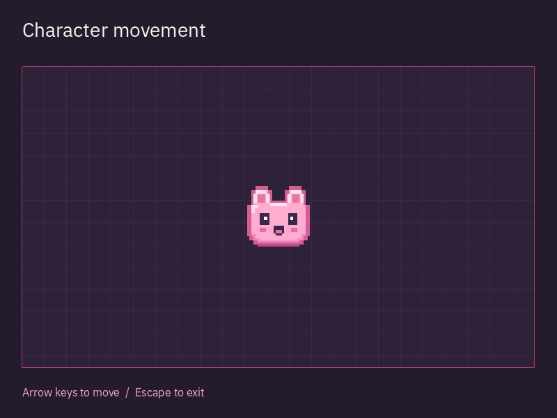

<p align="right"><a href="README.md">English</a> · <a href="README.ru.md">Русский</a> · <a href="README.zh-CN.md">简体中文</a> · Español · <a href="README.pt-BR.md">Português (BR)</a></p>

<h1 align="center">
  <picture>
    <source media="(prefers-color-scheme: dark) and (max-width: 480px)" srcset="docs/design/assets/sprite/logo-compact-dark.svg">
    <source media="(prefers-color-scheme: light) and (max-width: 480px)" srcset="docs/design/assets/sprite/logo-compact-light.svg">
    <source media="(prefers-color-scheme: dark)" srcset="docs/design/assets/sprite/logo-primary-dark.svg">
    <source media="(prefers-color-scheme: light)" srcset="docs/design/assets/sprite/logo-primary-light.svg">
    
  </picture>
</h1>

<p align="center">
  <a href="#installation"></a>
  <a href="#license"></a>
  <a href="https://github.com/edwardgushchin/Electron2D/releases"></a>
</p>

<p align="center">
  <a href="https://github.com/edwardgushchin/Electron2D/commits/main"></a>
  <a href="https://github.com/edwardgushchin/Electron2D/actions/workflows/ci.yml"></a>
  <a href="https://github.com/edwardgushchin/Electron2D/actions/workflows/ci.yml"></a>
</p>

<p align="center">
  <a href="#quick-start">Empezar</a> ·
  <a href="#features">Funciones</a> ·
  <a href="#platforms">Plataformas</a> ·
  <a href="#documentation">Documentación</a> ·
  <a href="#feedback-and-contributing">Participar</a>
</p>

<p align="center">⭐ <a href="https://github.com/edwardgushchin/Electron2D">Danos una estrella en GitHub</a> - ¡nos motiva mucho!</p>

<a id="about"></a>

##  Acerca del proyecto

Electron2D es un **motor 2D libre y multiplataforma, escrito en C#, para crear juegos en colaboración con agentes de IA**.

Crea mundos y mecánicas de juego con las herramientas habituales de .NET y asistentes de IA como Codex o Claude Code.

<a id="features"></a>

##  Funciones

- [Gráficos](docs/domains/rendering.md). Sprites y atlas, cámaras, paralaje, dibujo de formas y texto. Importación de shaders HLSL y GLSL para materiales.
- [Escenas y animación](docs/domains/scene.md). Objetos y niveles reutilizables, animación por fotogramas, animación de propiedades y temporizadores.
- [Física](docs/domains/physics.md). Cuerpos rígidos, colisiones, áreas, consultas de intersección, articulaciones y resortes.
- [Interfaz de juego](docs/domains/scene.md). Botones, campos de texto, desplazamiento, contenedores de diseño, fuentes y temas.
- [Audio](docs/domains/audio.md). WAV, MP3 y Ogg Vorbis, audio posicional, mezcla, efectos y grabación.
- [Controles](docs/domains/input.md). Teclado, ratón, entrada táctil y mandos. Asignación de entradas a acciones del juego.
- [Búsqueda de rutas](docs/domains/navigation.md). Rutas en una cuadrícula o entre puntos definidos, teniendo en cuenta obstáculos y costes de desplazamiento.
- [Recursos](docs/domains/resources.md). Carga de imágenes, fuentes y audio. Gradientes, curvas y texturas procedurales.
- [Localización](docs/domains/localization.md). Traducciones, formas plurales y selección de idioma.
- [Redes](docs/domains/networking.md). TCP, UDP, sockets locales y conexiones cifradas con TLS.

Los materiales con shaders requieren el renderizador GPU. El renderizador de compatibilidad admite gráficos 2D básicos. Consulta los enlaces anteriores para conocer los detalles y las limitaciones.

<a id="quick-start"></a>

##  Inicio rápido

Empieza con el ejemplo «Movimiento del personaje». Verás un personaje que puedes mover con las flechas. Los comandos de .NET siguientes se utilizan en Windows, Linux y macOS; consulta las comprobaciones de ejecución en la [tabla de plataformas](#platforms).

<a id="installation"></a>

### Requisitos

- [SDK de .NET 10](https://dotnet.microsoft.com/download/dotnet/10.0). Git solo es necesario para compilar desde el código fuente.

Instala mediante NuGet `Electron2D` y los paquetes de las plataformas de tu juego: `Electron2D.Windows`, `Electron2D.Linux`, `Electron2D.MacOS`, `Electron2D.Web`, `Electron2D.Android`, `Electron2D.iOS` o `Electron2D.tvOS`. Android TV usa `Electron2D.Android`; Apple TV usa `Electron2D.tvOS`. Las dependencias nativas se restauran automáticamente. [Paquetes de plataforma y reglas de versiones](docs/native-packaging.md).

Los paquetes preliminares requieren `--prerelease`. Usa versiones coincidentes del motor y los paquetes de plataforma. La publicación de los paquetes actuales `0.1.0-alpha` en nuget.org todavía no ha terminado.

### Compilar y ejecutar

Para compilar y ejecutar tu juego con NuGet, sigue las instrucciones de [Usar Electron2D en tu juego](#use-electron2d-in-your-game) más abajo. No necesitas el código fuente del motor ni un compilador nativo.

Para compilar desde el código fuente, clona el repositorio y compila la biblioteca:

```bash
git clone https://github.com/edwardgushchin/Electron2D.git
cd Electron2D
dotnet build Electron2D.csproj -c Release
```

Ejecuta el ejemplo:

```bash
dotnet run --project examples/CharacterMovement
```

Se abrirá una escena con un personaje rosa sobre una cuadrícula. Las flechas lo mueven dentro del campo; Escape o cerrar la ventana termina la aplicación. Prueba a cambiar la velocidad en `Player.cs` y ejecuta el ejemplo de nuevo.



[Código del ejemplo](examples/CharacterMovement/CharacterMovementScene.cs) · [Instrucciones de ejecución](examples/CharacterMovement/README.md)

<a id="use-electron2d-in-your-game"></a>

### Usar Electron2D en tu juego

Para un juego de escritorio con NuGet, crea un proyecto de consola de .NET 10 e instala el motor:

```bash
dotnet new console -n MyGame --framework net10.0
cd MyGame
dotnet add package Electron2D --prerelease
```

También puedes usar el código fuente del motor. En ese caso, ejecuta estos comandos desde la raíz del repositorio:

```bash
dotnet new console -n MyGame -o ../MyGame --framework net10.0
dotnet add ../MyGame/MyGame.csproj reference Electron2D.csproj
cd ../MyGame
```

Añade el paquete de tu plataforma mediante NuGet. Elige un comando:

| Plataforma | Comando |
| --- | --- |
| Windows | `dotnet add package Electron2D.Windows --prerelease` |
| Linux | `dotnet add package Electron2D.Linux --prerelease` |
| macOS | `dotnet add package Electron2D.MacOS --prerelease` |
| Web | `dotnet add package Electron2D.Web --prerelease` |
| Android | `dotnet add package Electron2D.Android --prerelease` |
| iOS | `dotnet add package Electron2D.iOS --prerelease` |
| Android TV | `dotnet add package Electron2D.Android --prerelease` |
| Apple TV (tvOS) | `dotnet add package Electron2D.tvOS --prerelease` |

Para varios destinos, añade cada paquete de plataforma necesario. Web, Android/Android TV e iOS/tvOS requieren la carga de trabajo de .NET y el host de aplicación correspondientes; el paquete de plataforma no proporciona ese host. El ejemplo de consola siguiente es solo para escritorio.

Sustituye el contenido de `Program.cs` por este código:

```csharp
using Electron2D;

var window = new Window
{
    Title = "Mi juego",
    Size = new Vector2i(800, 600)
};

return Engine.Run(window);
```

Ejecuta la aplicación:

```bash
dotnet build -c Release
dotnet run -c Release
```

Añade objetos del juego a la ventana con `AddChild`. El ejemplo anterior muestra la actualización por fotogramas y el manejo del teclado.

La compilación del motor genera `Electron2D.dll`. Al publicar el juego se incluyen la biblioteca del motor y las dependencias nativas; una publicación autónoma también incluye el entorno de ejecución de .NET.

<a id="platforms"></a>

##  Plataformas

La tabla indica qué se ha comprobado en cada plataforma del juego. El editor visual está destinado a Windows, Linux y macOS.

| Plataforma objetivo del juego | Comprobado en este repositorio |
| --- | --- |
| Windows, x86 / x64 / ARM64 | Las suites completas sin interfaz y las comprobaciones disponibles de recorte/AOT pasaron en CI. El renderizado no se ha comprobado |
| Linux, x64 / ARM64 | Las suites completas sin interfaz y las comprobaciones de recorte/AOT pasaron en ambas arquitecturas. En x64 se comprobaron ventanas, entrada y renderizado con Wayland, y renderizado con XWayland. El renderizado en ARM64 no se ha comprobado |
| macOS, x64 / ARM64 | Las suites completas sin interfaz y las comprobaciones de recorte/AOT pasaron en CI. El renderizado no se ha comprobado |
| Android, teléfonos y tabletas | Se han comprobado el renderizado, los materiales con shaders y la física en un teléfono ARM64 |
| Android TV | Se han comprobado el renderizador de compatibilidad y la física en un televisor de 32 bits |
| iOS y tvOS, dispositivos y simuladores | Los contratos nativos pasaron en los cuatro perfiles de simulador. Las aplicaciones para dispositivos se compilan sin firma; no se han comprobado la ejecución en dispositivos físicos ni el renderizado |
| Navegadores | Se han comprobado el renderizado y la física en una aplicación de prueba independiente. Todavía no se ha implementado la ejecución de juegos en el navegador |

Las comprobaciones de Android y navegador cubren escenarios concretos. Consulta la [distribución de bibliotecas nativas](docs/native-packaging.md) para saber cuáles están disponibles en tu plataforma.

Los indicadores de compilación y pruebas muestran el estado de las comprobaciones automáticas del código y las aplicaciones de prueba. La ejecución en dispositivos reales se comprueba por separado. [Detalles de las comprobaciones automáticas](docs/platform-verification.md#automated-rid-checks).

Consulta los modelos de dispositivos, los comandos y el alcance de las comprobaciones en el [informe de plataformas](docs/platform-verification.md).

<a id="development"></a>

##  Desarrollo del motor

Puedes guardar escenas en archivos y reutilizarlas, incluso en el siguiente inicio del juego, con `PackedScene` y [archivos tipados de recursos y escenas](docs/components/resource-files.md). El editor visual muestra por ahora una pantalla de inicio; la edición de proyectos de juego y los comandos para gestionarlos aún no están implementados.

La [arquitectura del motor](docs/decisions/agent-native.md#adr-0090) prevé comandos para que los asistentes de IA trabajen con proyectos y ejecuten escenarios de juego con comprobación de imágenes. El conjunto completo de herramientas aún está por implementar.

Las próximas tareas y el estado de los métodos se detallan en el [plan de desarrollo](docs/coverage/index.md). El comportamiento implementado se describe en la referencia de la API.

<a id="documentation"></a>

##  Documentación

| Necesitas | Dónde consultar |
| --- | --- |
| Encontrar una clase o un método | [Referencia de la API](docs/inventory.md) |
| Entender un subsistema | [Índice de documentación](docs/README.md) |
| Preparar shaders | [Herramienta de importación de HLSL y GLSL](tools/shaders/README.md) |
| Entender la arquitectura y las decisiones | [Decisiones de arquitectura](docs/decisions/index.md) |
| Elegir una tarea de desarrollo | [Plan de desarrollo](docs/coverage/index.md) |

<a id="examples"></a>

Hay instrucciones independientes para reproducir las comprobaciones de [Android](tests/Electron2D.AndroidProbe/README.md) y [WebGPU](tests/Electron2D.WebGpuProbe/README.md). La prueba de WebGPU comprueba las capacidades del navegador por separado del motor.

<a id="feedback-and-contributing"></a>

##  Participa en el proyecto

[Hacer una pregunta](https://github.com/edwardgushchin/Electron2D/discussions/categories/q-a) · [Reportar un problema](https://github.com/edwardgushchin/Electron2D/issues/new/choose) · [Guía de contribución](CONTRIBUTING.md) · [Ayuda](SUPPORT.md) · [Código de conducta](CODE_OF_CONDUCT.md) · [Seguridad](SECURITY.md)

Informa de errores y propón funciones en [GitHub Issues](https://github.com/edwardgushchin/Electron2D/issues). En un informe de error, indica la versión o el commit del motor, el sistema operativo y el renderizador. Adjunta un ejemplo mínimo y la salida del error.

Envía correcciones mediante [pull requests](https://github.com/edwardgushchin/Electron2D/pulls). Antes de empezar, lee la [guía de mantenimiento](docs/maintaining.md) y las decisiones de arquitectura del tema correspondiente. Actualiza el código, las pruebas y la documentación juntos.

Ejecuta las comprobaciones principales desde la raíz del repositorio:

```bash
dotnet run --project tests/Electron2D.Tests/Electron2D.Tests.csproj -c Release
tools/coverage/check.sh
```

<a id="contributors"></a>

El proyecto está a cargo de [Eduard Gushchin](https://github.com/edwardgushchin). Todos los autores de cambios aparecen en la [página de colaboradores de GitHub](https://github.com/edwardgushchin/Electron2D/graphs/contributors).

<a id="license"></a>

##  Licencia

Electron2D se distribuye bajo la [licencia MIT](licence/Electron2D-LICENSE.txt). Puedes usar el motor en juegos comerciales; conserva el aviso de derechos de autor y el texto de la licencia.

Las licencias de las dependencias se enumeran en los [avisos de componentes de terceros](licence/THIRD_PARTY_NOTICES.md). Al distribuir el juego, incluye los textos de licencia que exijan esas dependencias desde el directorio `licence/`.
